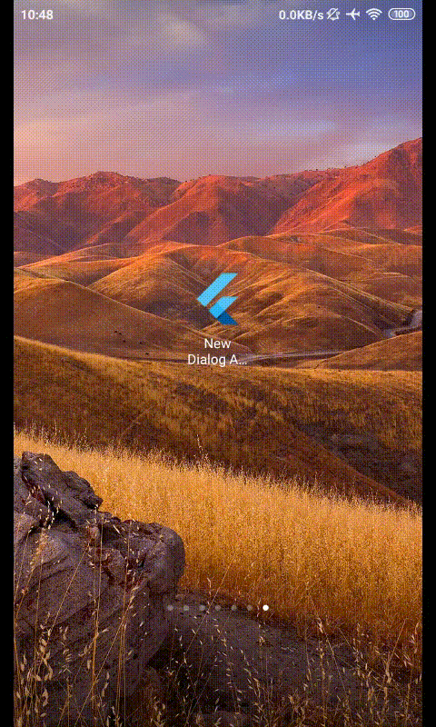

# New Dialog Animation

A Flutter app that demonstrates how to customize animation when popping out 
some dialog widget.

For demo, you may look here. [Bounce In Popup](#demo)

## 1. Creating New showDialog() method

Commonly, developer uses showDialog to put some dialog that overlays underlying
screen.

In this app, it is convenient to have new method so it can be simply reused 
through out our application. 

**new_dialog.dart**

``` dart
Future<T> showNewDialog<T>(

  return showGeneralDialog(
    ...
    transitionDuration: const Duration(milliseconds: 400),
    transitionBuilder: _buildNewTransition,
  );
}
```

> We only reuse showGeneralDialog() method, and customized its animation-related
parameters, its `transitionDuration` for Duration and its `transitionBuilder`
as Animating component.

## 2. Defining new Animating component

In this demo we create simple animation by wrapping our `child` widget into
`ScaleTransition`. Then we defined its curve, rather in `curve` param only, or 
in both of `curve` and `reverseCurve`.

**new_dialog.dart**
``` dart
Widget _buildNewTransition(
  BuildContext context,
  Animation<double> animation,
  Animation<double> secondaryAnimation,
  Widget child,
) {
  return ScaleTransition(
    scale: CurvedAnimation(
      parent: animation,
      curve: Curves.bounceIn,
      reverseCurve: Curves.bounceIn,
    ),
    child: child,
  );
}
```


## 3. Display our new Dialog

Lastly, we can call this animated dialog anywhere in our app by using this 
code :

**main.dart**
``` dart
RaisedButton.icon(
  icon: Icon(Icons.info_outline),
  label: Text("Open Dialog"),
  onPressed: () {
    showNewDialog(
      context: context,
      builder: (BuildContext context) {
        return AlertDialog(
          title: Text("Bounce In"),
        );
      },
    );
  },
),
```


## Demo
